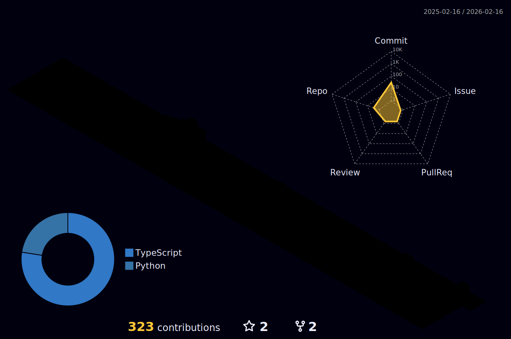

<!-- Simple Orange Header Text -->
<h1 align="center" style="font-size: 60px; color: #FF4500; font-family: 'Courier New', monospace;">
  <samp>
    <b><i>
      Hi, I'm Yugi 🍀
    </i></b>
  </samp>
</h1>

<!-- Centered Description with Orange Accent -->

  Fourth-Year Computer Science Student

---

  
  
  
  
  
  
  
  
  
  
  
  
  
  
  
  
  
  
  
  
  

## 🌟 About Me  
- 🔭 **Currently Working On:** Enhancing Deep Fake Detection using Residual Networks
- 🌱 **Learning:** Machine Learning & AI  
- 💬 **Ask Me About:** GitHub Actions, Automation, and DevOps  
- ⚡ **Fun Fact:** I love gaming and building side projects!  

---

<!-- 3D Contribution Graph -->

  

---

<!-- Contact Info Section with Icons -->

  
  
  

