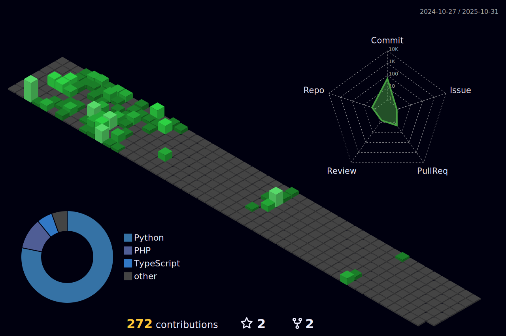

<h1 align="center">
  <samp>
    <b><i>
      Evergreen Greetings, I'm Yugi 🃠
    </i></b>
  </samp>
</h1>

  
  
  
  
  
  
  
  
  
  
  
  
  
  
  
  
  
  
  
  
  
  
  
  
  
  
  
  
  
  
  
  
  
  
  

<!-- Centered Description with Orange Accent -->

  ˚˖𓍢ִ໋`:✧˚.⋆𖧧 Fourth-Year Computer Science Student  ˚˖𓍢ִ໋`:✧˚.⋆𖧧

---

## 🌲 About Me 🌿  
- 🎋 **Education:** Fourth-Year **Computer Science Student**  
- 🌳 **Internship:** Solution Architect Intern at **FastTrack Solutions Inc.**  
- 🍃 **Current Project:** Enhancing **Residual Networks** for Deepfake Detection  
- 🌱 **Developer:** Creator of an immersive **Roblox game**  
- 🌴 **Passionate About:** Exploring automation, AI, and tech solutions  

---

<!-- 3D Contribution Graph -->

  

---

<!-- Contact Info Section with Icons -->

  
  
  

